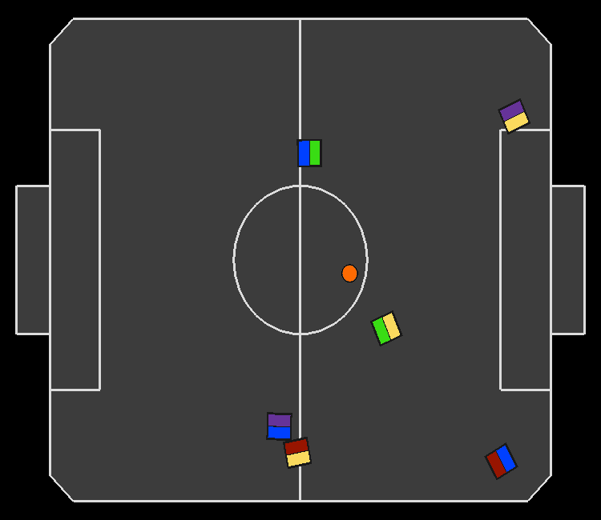
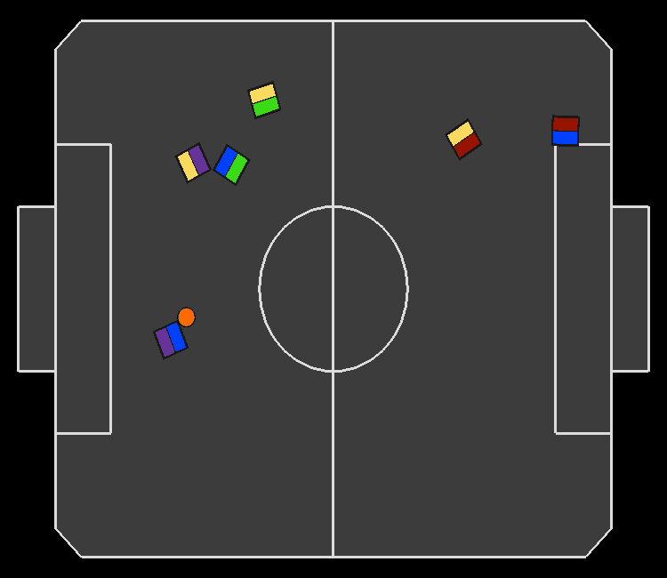
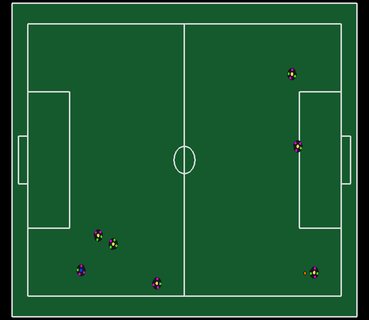
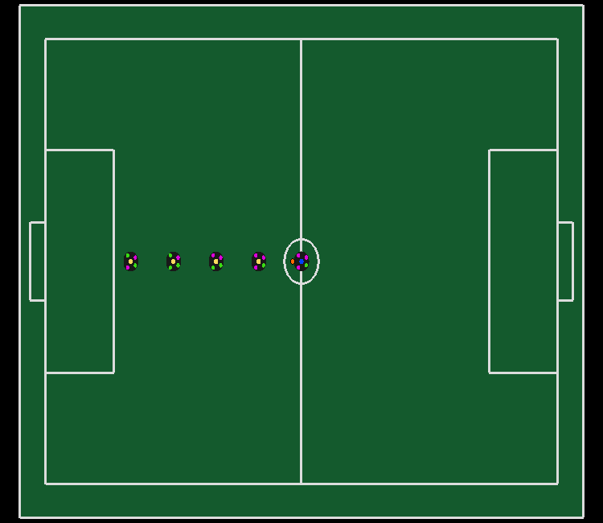
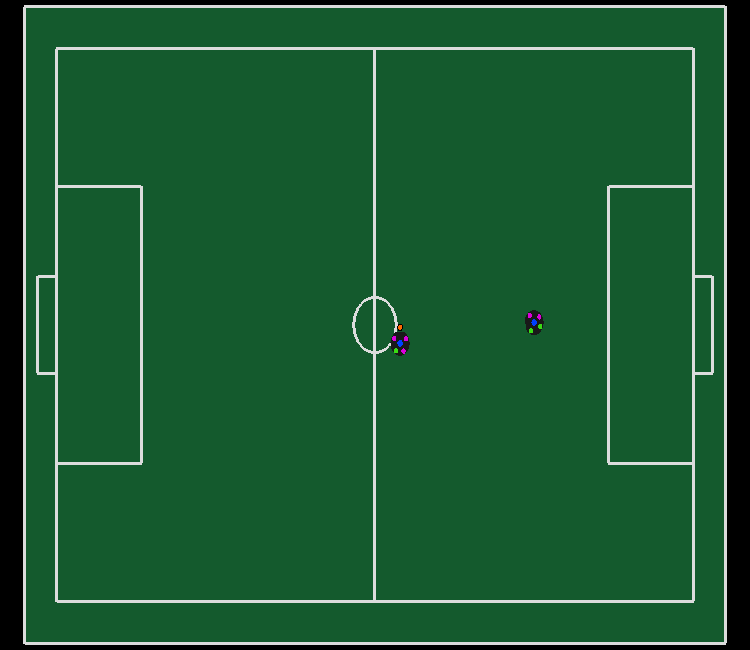
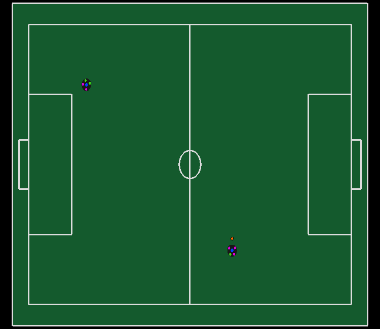

# RSoccer SSL and VSSS Gym environments

RSoccer Gym is an open-source framework to study Reinforcement Learning for SSL and IEEE VSSS competition environment. The simulation is done by [rSim](https://github.com/robocin/rsim) and it is one of the requirements.

## Reference

If you use this environment in your publication and want to cite it, utilize this BibTeX:

```
@misc{martins2021rsoccer,
      title={rSoccer: A Framework for Studying Reinforcement Learning in Small and Very Small Size Robot Soccer}, 
      author={Felipe B. Martins and Mateus G. Machado and Hansenclever F. Bassani and Pedro H. M. Braga and Edna S. Barros},
      year={2021},
      eprint={2106.12895},
      archivePrefix={arXiv},
      primaryClass={cs.LG}
}
```

## Requirements
- Python 3.7+
- OpenAI Gym
- [RSim](https://github.com/robocin/rSim) >= v1.2.0
- Pyglet
- Protobuf
## Install through The Python Package Index (PyPI)

```bash
pip install rsoccer-gym
```
## Install through Source
```bash
git clone https://github.com/robocin/rSoccer.git
cd rSoccer
pip install .
```
For [editable installs](https://setuptools.pypa.io/en/latest/userguide/development_mode.html), change last command to `"pip install -e ."`.
# Available Envs

IEEE VSSS                  |  IEEE VSSS Multi-Agent    |        GoTo Ball          | Static Defenders          |
:-------------------------:|:-------------------------:|:-------------------------:|:-------------------------:|
     |  |  |      |

  Contested Possession     |        Dribbling          |  Pass Endurance     |        Pass Endurance MA          |
:-------------------------:|:-------------------------:|:-------------------------:|:-------------------------:|
  | | | |

|       Environment Id                                                       | Observation Space | Action Space | Step limit |
|:--------------------------------------------------------------------------:|:-----------------:|:------------:|:----------:|
|[VSS-v0](rsoccer_gym/vss/README.md#vss-v0)                                       |      Box(40,)     |    Box(2,)   |    1200    |
|[VSSMA-v0](rsoccer_gym/vss/README.md#vssma-v0)                                   |      Box(3,40)    |    Box(3,2)  |    1200    |
|[VSSGk-v0](rsoccer_gym/vss/README.md#vssgk-v0)                                   |      Box(40,)     |    Box(2,)   |    1200    |
|[SSLGoToBall-v0](rsoccer_gym/ssl/README.md#sslgotoball-v0)                   |      Box(24,)     |    Box(3,)   |    2400        |
|[SSLGoToBallShoot-v0](rsoccer_gym/ssl/README.md#sslgotoballshoot-v0)             |      Box(12,)     |    Box(5,)   |    1200    |
|[SSLStaticDefenders-v0](rsoccer_gym/ssl/README.md#sslstaticdefenders-v0)         |      Box(24,)     |    Box(5,)   |    1000    |
|[SSLDribbling-v0](rsoccer_gym/ssl/README.md#ssldribbling-v0)                     |      Box(21,)     |    Box(4,)   |    4800    |
|[SSLContestedPossession-v0](rsoccer_gym/ssl/README.md#sslcontestedpossession-v0) |      Box(14,)     |    Box(5,)   |    1200    |
|[SSLPassEndurance-v0](rsoccer_gym/ssl/README.md#sslpassendurance-v0)             |      Box(18,)     |    Box(3,)   |    1200    |
|[SSLPassEnduranceMA-v0](rsoccer_gym/ssl/README.md#sslpassendurancema-v0)         |      Box(18,)     |    Box(2,3)  |    1200    |

# Example code - Environment

```python
import numpy as np
from gym.spaces import Box
from rsoccer_gym.Entities import Ball, Frame, Robot
from rsoccer_gym.ssl.ssl_gym_base import SSLBaseEnv


class SSLExampleEnv(SSLBaseEnv):
    def __init__(self):
        field = 0 # SSL Division A Field
        super().__init__(field_type=0, n_robots_blue=1,
                         n_robots_yellow=0, time_step=0.025)
        n_obs = 4 # Ball x,y and Robot x, y
        self.action_space = Box(low=-1, high=1, shape=(2, ))
        self.observation_space = Box(low=-self.field.length/2,\
            high=self.field.length/2,shape=(n_obs, ))

    def _frame_to_observations(self):
        ball, robot = self.frame.ball, self.frame.robots_blue[0]
        return np.array([ball.x, ball.y, robot.x, robot.y])

    def _get_commands(self, actions):
        return [Robot(yellow=False, id=0,
                      v_x=actions[0], v_y=actions[1])]

    def _calculate_reward_and_done(self):
        if self.frame.ball.x > self.field.length / 2 \
            and abs(self.frame.ball.y) < self.field.goal_width / 2:
            reward, done = 1, True
        else:
            reward, done = 0, False
        return reward, done
    
    def _get_initial_positions_frame(self):
        pos_frame: Frame = Frame()
        pos_frame.ball = Ball(x=(self.field.length/2)\
            - self.field.penalty_length, y=0.)
        pos_frame.robots_blue[0] = Robot(x=0., y=0., theta=0,)
        return pos_frame

```

# Example code - Agent

```python
import gym
import rsoccer_gym

# Using VSS Single Agent env
env = gym.make('VSS-v0')

env.reset()
# Run for 1 episode and print reward at the end
for i in range(1):
    done = False
    while not done:
        # Step using random actions
        action = env.action_space.sample()
        next_state, reward, done, _ = env.step(action)
        env.render()
    print(reward)
```
