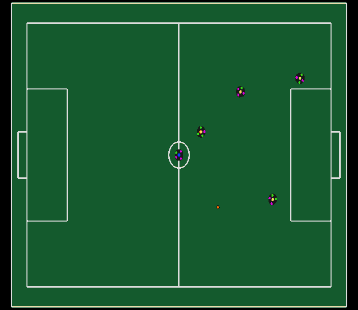
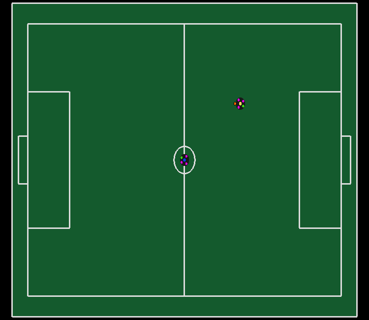
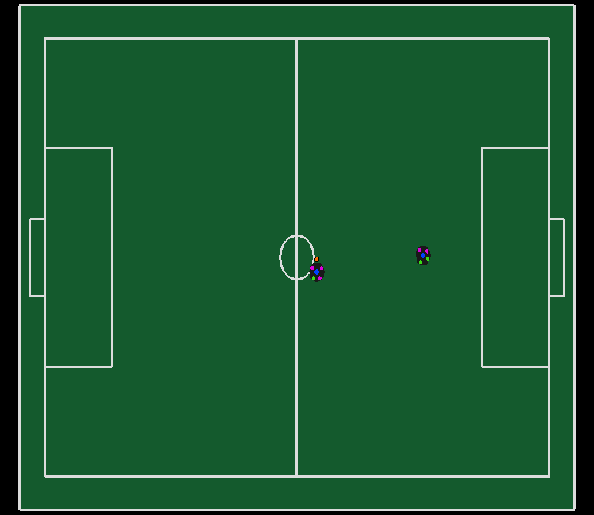

# RSoccer SSL and VSSS Gym environments

RSoccer Gym is an open-source framework to study Reinforcement Learning for SSL and IEEE VSSS competition environment. The simulation is done by [rSim](https://github.com/robocin/rsim) and it is one of the requirements.

## Reference

If you use this environment in your publication and want to cite it, utilize this BibTeX:

```
@InProceedings{10.1007/978-3-030-98682-7_14,
author="Martins, Felipe B.
and Machado, Mateus G.
and Bassani, Hansenclever F.
and Braga, Pedro H. M.
and Barros, Edna S.",
editor="Alami, Rachid
and Biswas, Joydeep
and Cakmak, Maya
and Obst, Oliver",
title="rSoccer: A Framework for Studying Reinforcement Learning in Small and Very Small Size Robot Soccer",
booktitle="RoboCup 2021: Robot World Cup XXIV",
year="2022",
publisher="Springer International Publishing",
address="Cham",
pages="165--176",
abstract="Reinforcement learning is an active research area with a vast number of applications in robotics, and the RoboCup competition is an interesting environment for studying and evaluating reinforcement learning methods. A known difficulty in applying reinforcement learning to robotics is the high number of experience samples required, being the use of simulated environments for training the agents followed by transfer learning to real-world (sim-to-real) a viable path. This article introduces an open-source simulator for the IEEE Very Small Size Soccer and the Small Size League optimized for reinforcement learning experiments. We also propose a framework for creating OpenAI Gym environments with a set of benchmarks tasks for evaluating single-agent and multi-agent robot soccer skills. We then demonstrate the learning capabilities of two state-of-the-art reinforcement learning methods as well as their limitations in certain scenarios introduced in this framework. We believe this will make it easier for more teams to compete in these categories using end-to-end reinforcement learning approaches and further develop this research area.",
isbn="978-3-030-98682-7"
}
```

## Requirements
- Python 3.7+
- gymnasium >= 0.28.1
- [RSim](https://github.com/robocin/rSim) == v1.2.0
## Install through The Python Package Index (PyPI)

```bash
pip install rsoccer-gym
```
## Install through Source
```bash
git clone https://github.com/robocin/rSoccer.git
cd rSoccer
pip install .
```
For [editable installs](https://setuptools.pypa.io/en/latest/userguide/development_mode.html), change last command to `"pip install -e ."`.
# Available Envs

IEEE VSSS                  |
:-------------------------:|
     |

 Static Defenders          |  Contested Possession     |
:-------------------------:|:-------------------------:|
       | |

Dribbling          |  Pass Endurance     |
:-------------------------:|:-------------------------:|
 | |

|       Environment Id                                                       | Observation Space | Action Space | Step limit |
|:--------------------------------------------------------------------------:|:-----------------:|:------------:|:----------:|
|[VSS-v0](rsoccer_gym/vss/README.md#vss-v0)                                       |      Box(40,)     |    Box(2,)   |    1200    |
|[SSLStaticDefenders-v0](rsoccer_gym/ssl/README.md#sslstaticdefenders-v0)         |      Box(24,)     |    Box(5,)   |    1000    |
|[SSLDribbling-v0](rsoccer_gym/ssl/README.md#ssldribbling-v0)                     |      Box(21,)     |    Box(4,)   |    4800    |
|[SSLContestedPossession-v0](rsoccer_gym/ssl/README.md#sslcontestedpossession-v0) |      Box(14,)     |    Box(5,)   |    1200    |
|[SSLPassEndurance-v0](rsoccer_gym/ssl/README.md#sslpassendurance-v0)             |      Box(18,)     |    Box(3,)   |    1200    |

# Example code - Environment

```python
import numpy as np
from gymnasium.spaces import Box
from rsoccer_gym.Entities import Ball, Frame, Robot
from rsoccer_gym.ssl.ssl_gym_base import SSLBaseEnv


class SSLExampleEnv(SSLBaseEnv):
    def __init__(self, render_mode=None):
        field = 0 # SSL Division A Field
        super().__init__(field_type=0, n_robots_blue=1,
                         n_robots_yellow=0, time_step=0.025,
                         render_mode=render_mode)
        n_obs = 4 # Ball x,y and Robot x, y
        self.action_space = Box(low=-1, high=1, shape=(2, ))
        self.observation_space = Box(low=-self.field.length/2,\
            high=self.field.length/2,shape=(n_obs, ))

    def _frame_to_observations(self):
        ball, robot = self.frame.ball, self.frame.robots_blue[0]
        return np.array([ball.x, ball.y, robot.x, robot.y])

    def _get_commands(self, actions):
        return [Robot(yellow=False, id=0,
                      v_x=actions[0], v_y=actions[1])]

    def _calculate_reward_and_done(self):
        if self.frame.ball.x > self.field.length / 2 \
            and abs(self.frame.ball.y) < self.field.goal_width / 2:
            reward, done = 1, True
        else:
            reward, done = 0, False
        return reward, done
    
    def _get_initial_positions_frame(self):
        pos_frame: Frame = Frame()
        pos_frame.ball = Ball(x=(self.field.length/2)\
            - self.field.penalty_length, y=0.)
        pos_frame.robots_blue[0] = Robot(x=0., y=0., theta=0,)
        return pos_frame

```

# Example code - Agent

```python
import gymnasium as gym
import rsoccer_gym

# Using VSS Single Agent env
env = gym.make('VSS-v0', render_mode="human")

env.reset()
# Run for 1 episode and print reward at the end
for i in range(1):
    terminated = False
    truncated = False
    while not (terminated or truncated):
        # Step using random actions
        action = env.action_space.sample()
        next_state, reward, terminated, truncated, _ = env.step(action)
    print(reward)
```
