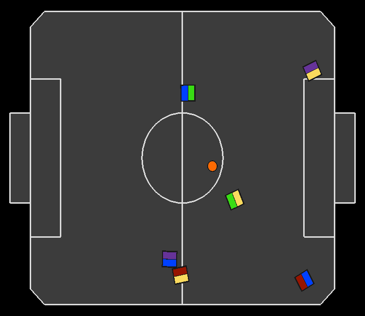
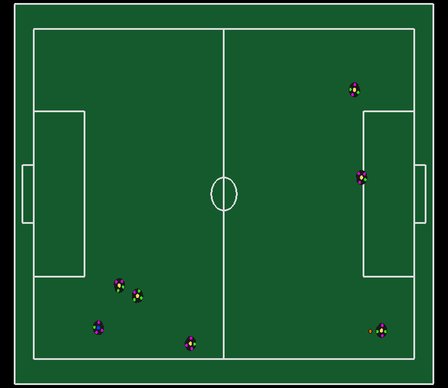
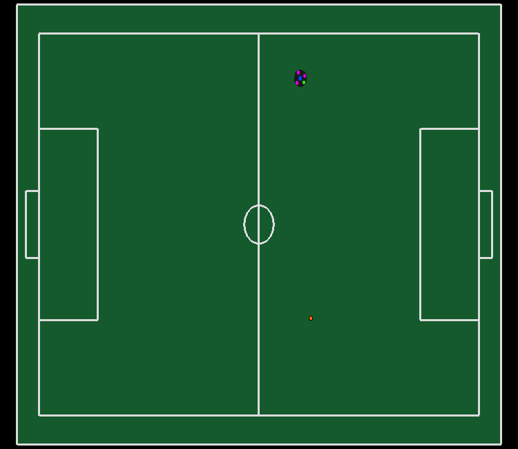
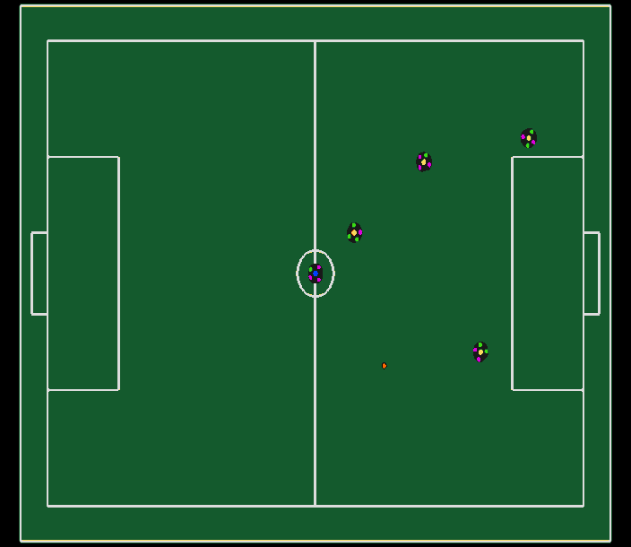
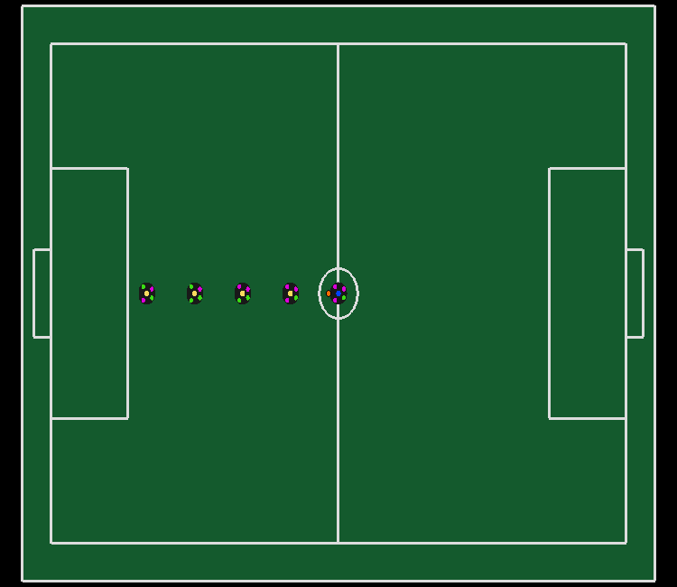
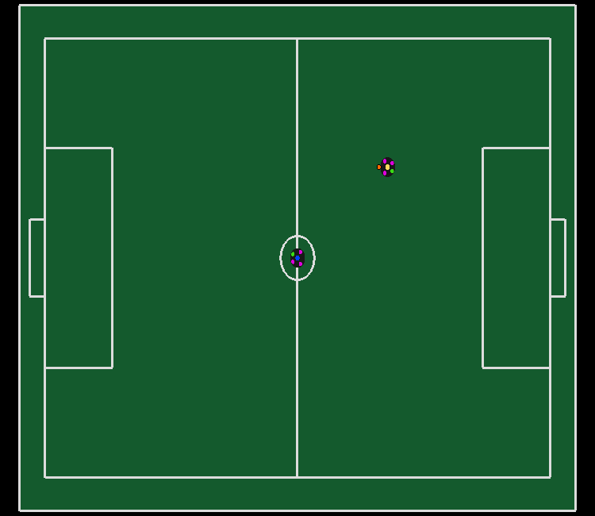

# RoboSim VSSS and SSL gym environments

## Install environments

```bash
$ pip install -e .
```
# Available Envs
## VSS
- **VSS-v0**


- **VSSFIRA-v0** [Needs to run with FIRASIm]
- **VSSMA-v0**
- **VSSMAOpp-v0** [Needs a attacker model trained on VSS-v0]
- **VSSGk-v0** [Needs a attacker model trained on VSS-v0]
## SSL
- **SSLGoToBall-v0**
- **SSLGoToBall-v1**
- **SSLGoToBallIR-v0**
- **SSLGoToBallIR-v1**


- **SSLGoToBallShoot-v0**
- **SSLGoToBallShoot-v1**
- **SSLGoToBallShoot-v2**
- **SSLGoToBallShoot-v3**


- **SSLHWStaticDefenders-v0**


- **SSLHWDribbling-v0**


- **SSLContestedPossessionEnv-v0**


- **SSLPassEndurance-v0**


# Example code
```python
import gym
import rc_gym

# Using VSS 3v3 env
env = gym.make('VSS3v3-v0')

env.reset()
# Run for 1 episode and print reward at the end
for i in range(1):
    done = False
    while not done:
        # Step using random actions
        action = env.action_space.sample()
        next_state, reward, done, _ = env.step(action)
    print(reward)
```
