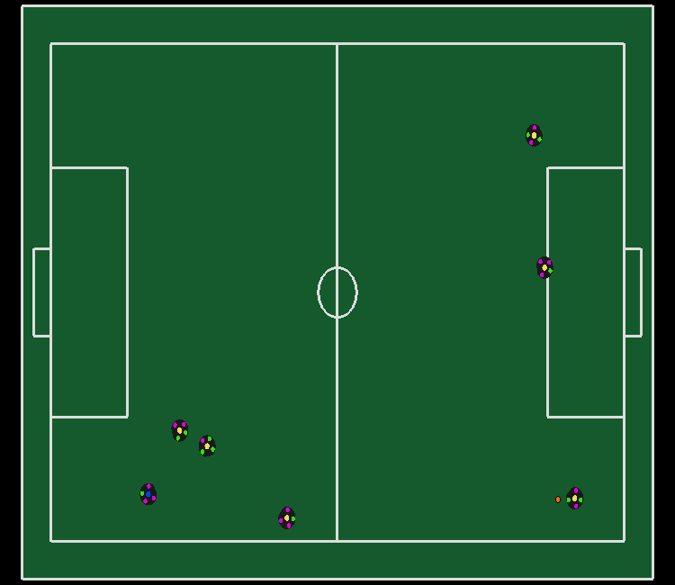
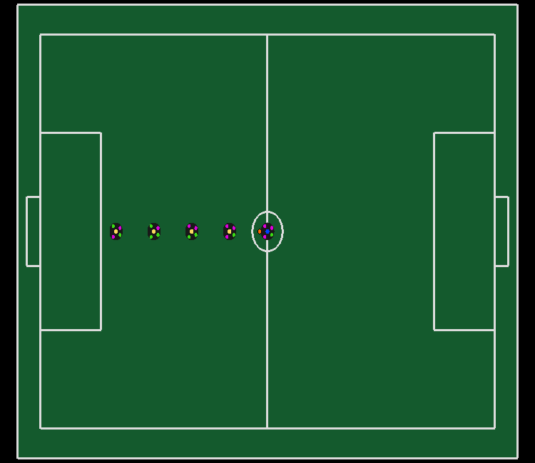
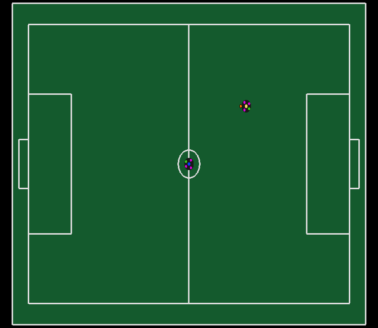
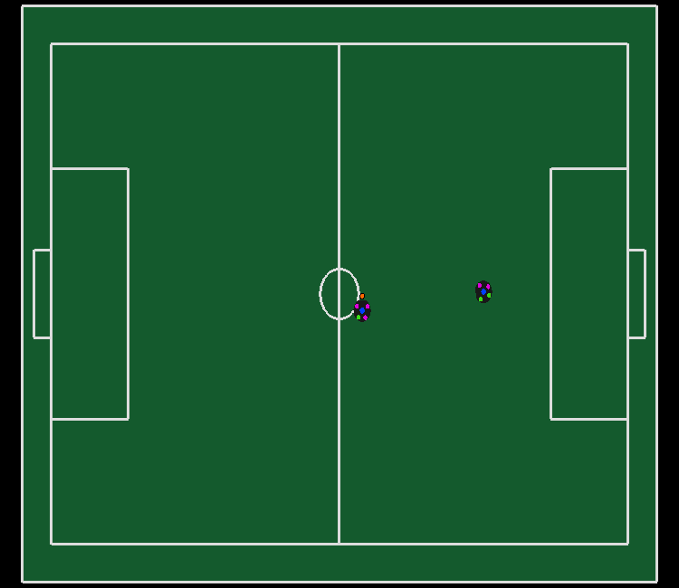

# SSL gym environments

Creating new environments is done over inheritance of the SSL base class through the following steps:
+ Setting the field type (0 for the 6 vs 6 competition field size, 1 for 11 vs 11 and 2 for the field size specified on the 2021 hardware challenges), the number of blue and yellow robots and the simulation time step.
+ Defining the obsevation and action spaces as [gym.Spaces](https://gym.openai.com/docs/#spaces) types.
+ Implement the base class methods:
    + _get_commands
    + _frame_to_observations
    + _calculate_reward_and_done
    + _get_initial_positions_frame
+ Register the environment and set the maximum number of steps in an episode on [**__init__**](../__init__.py) 

The base environment define normalization methods using field size and robot parameters values which are used on the available environments.

# Available Envs
- [**SSLGoToBall-v0**](#sslgotoball-v0)
- [**SSLGoToBallShoot-v0**](#sslgotoballshoot-v0)
- [**SSLStaticDefenders-v0**](#sslstaticdefenders-v0)
- [**SSLDribbling-v0**](#ssldribbling-v0)
- [**SSLContestedPossession-v0**](#sslcontestedpossession-v0)
- [**SSLPassEndurance-v0**](#sslpassendurance-v0)
- [**SSLPassEnduranceMA-v0**](#sslpassendurancema-v0)

# SSLGoToBall-v0
In this environment the yellow team has six stopped robots and the blue team has one controlled robot. The episode ends when the robot's infrared detects the ball.

    

- ## Observations:
    - Box(24,)
    - Value Range: [-1.25, 1.25] (Normalized)

    | Index        	| Observation                	|
    |--------------	|----------------------------	|
    | 0            	| Ball X                     	|
    | 1            	| Ball Y                     	|
    | 2            	| Ball Vx                    	|
    | 3            	| Ball Vy                    	|
    | 4  	        | id 0 Blue Robot X          	|
    | 5  	        | id 0 Blue Robot Y          	|
    | 6  	        | id 0 Blue Robot sin(theta) 	|
    | 7  	        | id 0 Blue Robot cos(theta) 	|
    | 8  	        | id 0 Blue Robot Vx         	|
    | 9  	        | id 0 Blue Robot Vy         	|
    | 10 	        | id 0 Blue Robot v_theta    	|
    | 11 + (2 * i) 	| id i Yellow Robot X        	|
    | 12 + (2 * i) 	| id i Yellow Robot Y        	|

- ## Actions:
    - Box(3,)
    - Value Range: [-1, 1]

    | Index | Action        |
    |-------|---------------|
    | 0     | Axis X speed |
    | 1     | Axis Y speed |
    | 2     | Axis theta speed |

- ## Rewards:
    - Distance to ball gradient
    - Energy
    - Reached objective
- ## Done:
    When the robot's infrared detects the ball

-----

# SSLGoToBallShoot-v0
In this environment there is no yellow team and the blue team has one controlled robot. The episode ends when a goal occurs.

    

- ## Observations:
    - Box(40,)
    - Value Range: [-1.25, 1.25] (Normalized)

    | Index        	| Observation                	|
    |--------------	|----------------------------	|
    | 0            	| Ball X                     	|
    | 1            	| Ball Y                     	|
    | 2            	| Ball Vx                    	|
    | 3            	| Ball Vy                    	|
    | 4 + (7 * i)  	| id i Blue Robot X          	|
    | 5 + (7 * i)  	| id i Blue Robot Y          	|
    | 6 + (7 * i)  	| id i Blue Robot sin(theta) 	|
    | 7 + (7 * i)  	| id i Blue Robot cos(theta) 	|
    | 8 + (7 * i)  	| id i Blue Robot Vx         	|
    | 9  + (7 * i) 	| id i Blue Robot Vy         	|
    | 10 + (7 * i) 	| id i Blue Robot v_theta    	|

- ## Actions:
    - Box(5,)
    - Value Range: [-1, 1]

    | Index | Action        |
    |-------|---------------|
    | 0     | Axis X speed |
    | 1     | Axis Y speed |
    | 2     | Axis theta speed |
    | 3     | Kicker power |
    | 4     | Active Dribbler |

- ## Rewards:
    - Distance to ball gradient
    - Ball potential gradient
    - Energy
    - Goal
- ## Done:
    When a goal happens

-----

# SSLStaticDefenders-v0
In this environment the yellow team has six stopped robots and the blue team has one controlled robot. The episode ends when a goal occurs.

    

- ## Observations:
    - Box(24,)
    - Value Range: [-1.25, 1.25] (Normalized)

    | Index        	| Observation                	|
    |--------------	|----------------------------	|
    | 0            	| Ball X                     	|
    | 1            	| Ball Y                     	|
    | 2            	| Ball Vx                    	|
    | 3            	| Ball Vy                    	|
    | 4  	        | id 0 Blue Robot X          	|
    | 5  	        | id 0 Blue Robot Y          	|
    | 6  	        | id 0 Blue Robot sin(theta) 	|
    | 7  	        | id 0 Blue Robot cos(theta) 	|
    | 8  	        | id 0 Blue Robot Vx         	|
    | 9  	        | id 0 Blue Robot Vy         	|
    | 10 	        | id 0 Blue Robot v_theta    	|
    | 11 + (2 * i) 	| id i Yellow Robot X        	|
    | 12 + (2 * i) 	| id i Yellow Robot Y        	|

- ## Actions:
    - Box(5,)
    - Value Range: [-1, 1]

    | Index | Action        |
    |-------|---------------|
    | 0     | Axis X speed |
    | 1     | Axis Y speed |
    | 2     | Axis theta speed |
    | 3     | Kicker power |
    | 4     | Active Dribbler |

- ## Rewards:
    - Move
    - Ball potential gradient
    - Energy
    - Goal
- ## Done:
    When a goal happens

-----

# SSLDribbling-v0
In this environment the yellow team has four stopped robots and the blue team has one controlled robot. The controlled robot must zigzag the robots and then pass the last gate three times.The episode ends when the robot's completes the task.

    

- ## Observations:
    - Box(21,)
    - Value Range: [-1.25, 1.25] (Normalized)

    | Index        	| Observation                	|
    |--------------	|----------------------------	|
    | 0	            | Actual Gate               	|
    | 1            	| Ball X                     	|
    | 2            	| Ball Y                     	|
    | 3            	| Ball Vx                    	|
    | 4            	| Ball Vy                    	|
    | 5  	        | id 0 Blue Robot X          	|
    | 6  	        | id 0 Blue Robot Y          	|
    | 7  	        | id 0 Blue Robot sin(theta) 	|
    | 8  	        | id 0 Blue Robot cos(theta) 	|
    | 9  	        | id 0 Blue Robot Vx         	|
    | 10            | id 0 Blue Robot Vy         	|
    | 11 	        | id 0 Blue Robot v_theta    	|
    | 12 	        | id 0 Blue Robot infrared    	|
    | 13 + (2 * i) 	| id i Yellow Robot X        	|
    | 13 + (2 * i) 	| id i Yellow Robot Y        	|

- ## Actions:
    - Box(4,)
    - Value Range: [-1, 1]

    | Index | Action        |
    |-------|---------------|
    | 0     | Axis X speed |
    | 1     | Axis Y speed |
    | 2     | Axis theta speed |
    | 3     | Active Dribbler |

- ## Rewards:
    - Gate passed
- ## Done:
    Agent completes the task

-----

# SSLContestedPossession-v0
In this environment each team has 1 robot, in which the id 0 blue robot is controlled and the other robot is stopped and dribbling the ball. The objective of this challenge is to sneak theball from the opponent and score a goal. The episode ends when a goal occurs. 

    

- ## Observations:
    - Box(14,)
    - Value Range: [-1.25, 1.25] (Normalized)

    | Index        	| Observation                	|
    |--------------	|----------------------------	|
    | 0	            | Actual Gate               	|
    | 1            	| Ball X                     	|
    | 2            	| Ball Y                     	|
    | 3            	| Ball Vx                    	|
    | 4            	| Ball Vy                    	|
    | 5  	        | id 0 Blue Robot X          	|
    | 6  	        | id 0 Blue Robot Y          	|
    | 7  	        | id 0 Blue Robot sin(theta) 	|
    | 8  	        | id 0 Blue Robot cos(theta) 	|
    | 9  	        | id 0 Blue Robot Vx         	|
    | 10            | id 0 Blue Robot Vy         	|
    | 11 	        | id 0 Blue Robot v_theta    	|
    | 12 	        | id 0 Blue Robot infrared    	|
    | 13 	        | id 0 Yellow Robot X        	|
    | 14 	        | id 0 Yellow Robot Y        	|

- ## Actions:
    - Box(5,)
    - Value Range: [-1, 1]

    | Index | Action        |
    |-------|---------------|
    | 0     | Axis X speed |
    | 1     | Axis Y speed |
    | 2     | Axis theta speed |
    | 3     | Kicker power |
    | 4     | Active Dribbler |

- ## Rewards:
    - Move
    - Ball potential gradient
    - Energy
    - Goal
- ## Done:
    When a goal happens

-----

# SSLPassEndurance-v0
In this environment the  episode  begins  with  the  two robots at random position with the ball on the dribbler of the controlled one. There are no opponents in this environment. The objective is to perform a pass. The episode ends if a pass happens.

    

- ## Observations:
    - Box(18,)
    - Value Range: [-1.25, 1.25] (Normalized)

    | Index        	| Observation                	|
    |--------------	|----------------------------	|
    | 0            	| Ball X                     	|
    | 1            	| Ball Y                     	|
    | 2            	| Ball Vx                    	|
    | 3            	| Ball Vy                    	|
    | 4 + (7 * i)  	| id i Blue Robot X          	|
    | 5 + (7 * i)  	| id i Blue Robot Y          	|
    | 6 + (7 * i)  	| id i Blue Robot sin(theta) 	|
    | 7 + (7 * i)  	| id i Blue Robot cos(theta) 	|
    | 8 + (7 * i)  	| id i Blue Robot Vx         	|
    | 9  + (7 * i) 	| id i Blue Robot Vy         	|
    | 10 + (7 * i) 	| id i Blue Robot v_theta    	|
    | 11 + (7 * i) 	| id i Blue Robot infrared    	|
    | 12 + (7 * i) 	| id i Blue Robot is_shooter   	|

- ## Actions:
    - Box(3,)
    - Value Range: [-1, 1]

    | Index | Action        |
    |-------|---------------|
    | 0     | Axis theta speed |
    | 1     | Kicker power |
    | 2     | Active Dribbler |

- ## Rewards:
    - Ball potential gradient
    - Pass happened
- ## Done:
    When a pass happens

-----

# SSLPassEnduranceMA-v0
the  episode  begins  with  the  two  controlled  agents  at random positi on with the ball on the dribbler of one of them. There are no opponents in this environment. The objective is to perform as many passes as possible in 30 seconds. The episode ends if any pass does not reach the teamate.

    

- ## Observations:
    - Box(18,)
    - Value Range: [-1.25, 1.25] (Normalized)

    | Index        	| Observation                	|
    |--------------	|----------------------------	|
    | 0            	| Ball X                     	|
    | 1            	| Ball Y                     	|
    | 2            	| Ball Vx                    	|
    | 3            	| Ball Vy                    	|
    | 4 + (7 * i)  	| id i Blue Robot X          	|
    | 5 + (7 * i)  	| id i Blue Robot Y          	|
    | 6 + (7 * i)  	| id i Blue Robot sin(theta) 	|
    | 7 + (7 * i)  	| id i Blue Robot cos(theta) 	|
    | 8 + (7 * i)  	| id i Blue Robot Vx         	|
    | 9  + (7 * i) 	| id i Blue Robot Vy         	|
    | 10 + (7 * i) 	| id i Blue Robot v_theta    	|
    | 11 + (7 * i) 	| id i Blue Robot infrared    	|
    | 12 + (7 * i) 	| id i Blue Robot is_shooter   	|

- ## Actions:
    - Box(5,)
    - Value Range: [-1, 1]

    | Index | Action        |
    |-------|---------------|
    | 0     | Axis X speed |
    | 1     | Axis Y speed |
    | 2     | Axis theta speed |
    | 3     | Kicker power |
    | 4     | Active Dribbler |

- ## Rewards:
    - Ball potential gradient
    - Pass happened
- ## Done:
    When time is over

-----